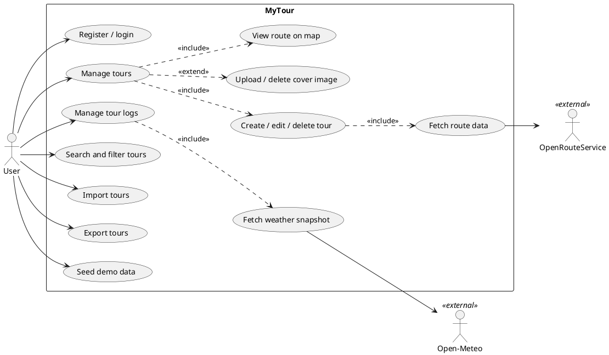
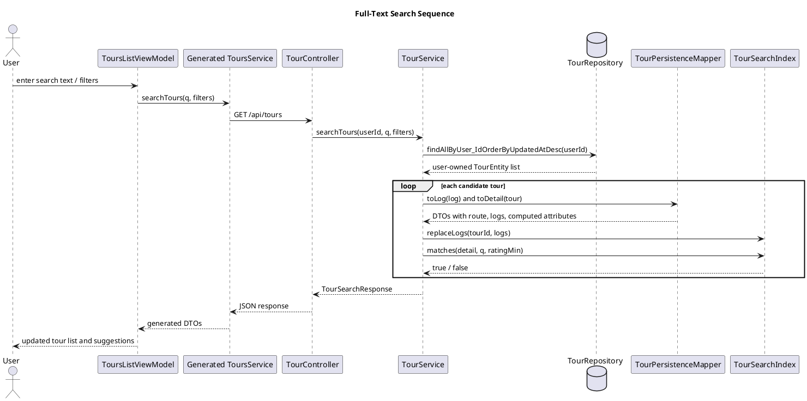
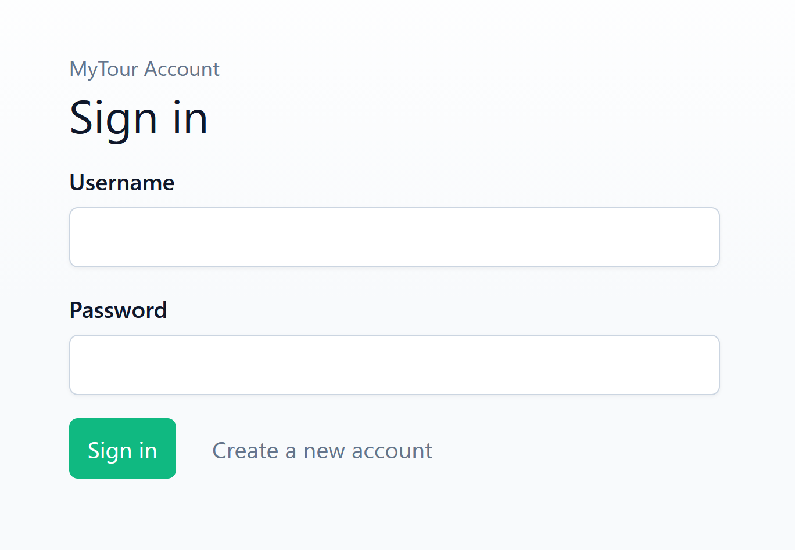
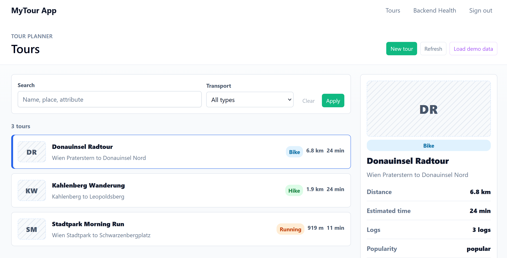
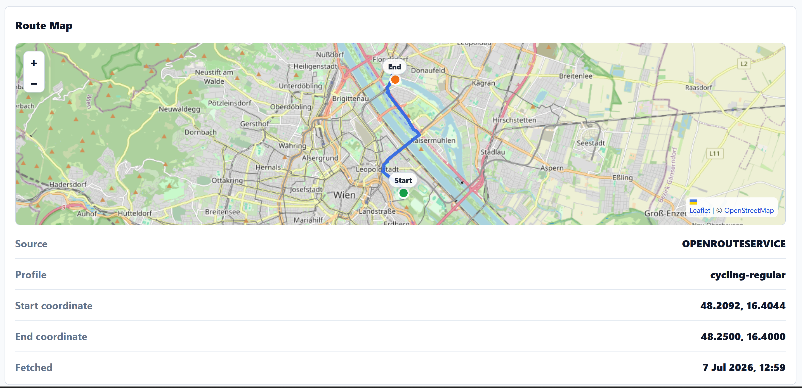
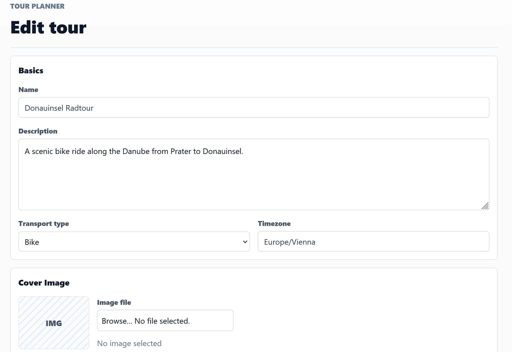
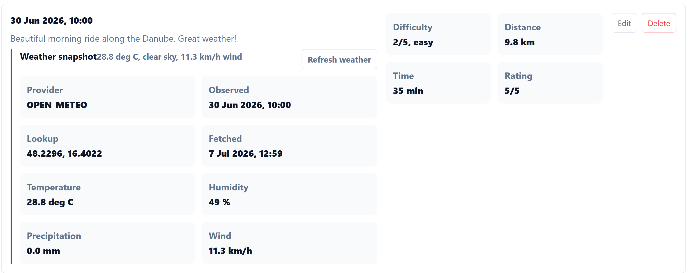
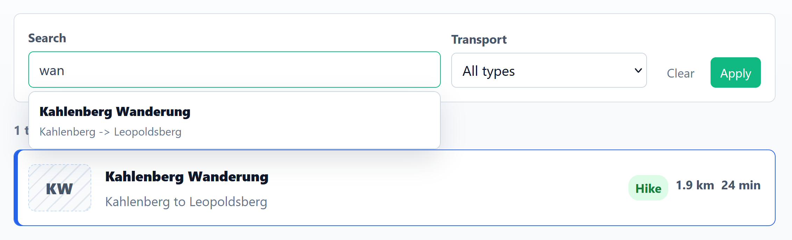
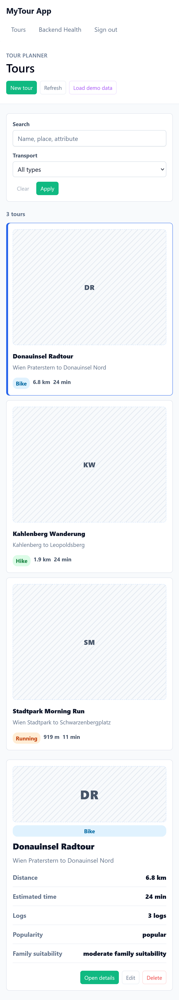

# MyTour Final Protocol

## Project Information

**Project:** MyTour / Tour Planner  
**Hand-in:** Final submission  
**Technology stack:** Angular frontend, Spring Boot backend, PostgreSQL database  
**Date:** 2026-07-07  
**Team:** Tarik Yilmaz & Peyman Aparviz

## 1. Final Scope

MyTour is a two-tier tour-planning application. The Angular frontend provides the user interface and communicates with a Spring Boot backend over HTTP/JSON. The backend contains the business logic, persistence logic, external API clients, and security handling. PostgreSQL stores users, tours, routes, logs, computed attributes, and generated weather snapshots. Cover images are stored externally on the filesystem; the database stores only metadata and path references.

The final implementation covers the required project features:

- Self-registration and login with username/password credentials.
- JWT-protected user-owned tours and tour logs.
- Full CRUD for tours and tour logs.
- PostgreSQL persistence through Spring Data JPA/Hibernate.
- Flyway database initialization.
- OpenRouteService route retrieval for distance, duration, coordinates, and GeoJSON route geometry.
- Leaflet map rendering in the Angular tour detail view.
- Cover-image upload/delete with filesystem storage.
- Computed tour attributes: popularity and child-friendliness.
- Full-text-style search across tour fields, log fields, weather text, and computed labels.
- Import/export of tour data as JSON.
- Unique feature: automatic weather snapshots for tour logs through Open-Meteo.
- Backend and frontend unit tests.

## 2. Architecture

### Backend Layers

The backend follows a layer-based architecture with clearly separated packages:

| Layer / package | Responsibility |
| --- | --- |
| `controller` | HTTP endpoints, request/response mapping, authentication boundary. |
| `service` | Business logic for tours, logs, auth, route calculation, weather snapshots, import/export, search, and computed attributes. |
| `repository` | Spring Data JPA repositories and user-scoped database access. |
| `domain` | JPA entities and persistent enum types. |
| `dto` | API request/response records exposed through OpenAPI. |
| `mapper` | Conversion between entities and DTOs, including JSON route geometry conversion. |
| `client` | External API clients for OpenRouteService and Open-Meteo. |
| `config` | Application, client, storage, CORS, security, and OpenAPI configuration. |
| `exception` | Application-specific exceptions and centralized error response handling. |
| `security` | JWT creation/validation, current-user lookup, authentication filter. |

The dependency direction is enforced by `LayerDependencyRulesTest`. Controllers call services, services call repositories/clients/mappers, repositories know only domain entities, and external clients do not call service classes. The layer audit is documented in `mytour-api/docs/layer-rules.md`.

### Frontend Structure

The Angular frontend uses an MVVM-style structure:

- Components own templates and user interaction.
- ViewModel services hold state, derived values, loading/error flags, and orchestration.
- API application services wrap the generated OpenAPI client where needed.
- Generated models/services in `src/app/api/generated` represent the backend contract.

Important frontend areas:

| Area | Responsibility |
| --- | --- |
| `auth` | Login/register UI, JWT session storage, auth guard/interceptor. |
| `tours/tours-list` | Search, filters, suggestions, tour list, selected-tour preview. |
| `tours/tour-detail` | Full tour details, map, logs, weather snapshots, import/export actions. |
| `tours/tour-form` | Create/edit tour form, location autocomplete, cover-image upload. |
| `tours/tour-log-form` | Create/edit tour log form with timezone-aware date handling. |
| `tours/tour-map` | Leaflet integration through `LeafletMapFacade`. |
| `shared` | Reusable status-message component and shared UI helpers. |

## 3. Database Design

The database is initialized by Flyway migration `mytour-api/src/main/resources/db/migration/V1__init_schema.sql`. Hibernate validates the schema at startup with `spring.jpa.hibernate.ddl-auto=validate`.

Persistent tables:

- `app_users`
- `tours`
- `tour_routes`
- `tour_logs`
- `tour_log_weather`

Main relationships:

- One user owns many tours.
- One tour has zero or one route row.
- One tour has many tour logs.
- One tour log has zero or one weather snapshot.

The current database/domain diagram is maintained in `mytour-api/database-class-diagram.puml`. It was checked against `V1__init_schema.sql` during final documentation work; the persistent columns and relationships match the DB init migration. The migration contains the detailed constraints, indexes, defaults, and cascade rules.

Route geometry is stored as PostgreSQL `jsonb` in `tour_routes.route_geometry`. The entity uses Jackson `JsonNode` for persistence, while the public API DTO exposes `routeGeometry` as a JSON-compatible `Map<String, Object>`. This avoids a Jackson 2/Jackson 3 serialization mismatch and ensures API responses contain the actual OpenRouteService GeoJSON `FeatureCollection`.

## 4. UML Diagrams

### Use-Case Diagram

Source file: `mytour-api/use-case.puml`



### Class / Database Diagram

Source file: `mytour-api/database-class-diagram.puml`

The diagram documents the persistent domain classes, their columns, enum types, and relationships. It intentionally keeps detailed SQL constraints and indexes in the Flyway migration so the schema source of truth remains executable.

### Full-Text Search Sequence Diagram

Source file: `mytour-api/full-text-search-sequence.puml`



## 5. UX And Wireframes

The UI follows a master-detail workflow. The tours list is the main workspace, while dedicated pages handle full details and editing. Search and filters are available directly on the list so the user can narrow large tour collections without leaving the main view.

Main UX decisions:

- Authentication gates the tour area, because tours and logs are user-owned.
- The tour list combines search, filters, suggestions, and selected-tour preview.
- The tour detail page groups route/map data, computed attributes, cover image metadata, logs, and weather snapshots.
- Forms are separated into tour and tour-log forms to keep validation and navigation simple.
- Destructive actions require confirmation.
- The Leaflet map is hidden behind a small component/facade boundary so map setup and cleanup do not pollute page components.
- Desktop layouts use more columns; narrow screens collapse into a single-column workflow.

### Text Wireframe: Tours Overview

```text
+----------------------------------------------------------------------------------+
| MyTour                                     Search / Filters        [New Tour]     |
+----------------------------------------------------------------------------------+
| [Search tours/logs/weather] [Transport] [Popularity] [Family] [Rating] [Apply]   |
+----------------------------------------------------------------------------------+
| Tour list                                             | Selected tour             |
|------------------------------------------------------+---------------------------|
| Cover  Danube Ride     Bike   popular   family       | Title, route, stats       |
|        Wien -> Donauinsel                            | cover image metadata      |
|------------------------------------------------------+ route/map summary         |
| Cover  Kahlenberg Hike Hike   rarely used            | [Open] [Edit] [Delete]    |
+----------------------------------------------------------------------------------+
```

### Text Wireframe: Tour Detail

```text
+----------------------------------------------------------------------------------+
| [Back] Tour title                                         [Edit] [Export]         |
+----------------------------------------------------------------------------------+
| Summary / computed attributes        | Route data and Leaflet map                |
|--------------------------------------+-------------------------------------------|
| Distance, time, popularity, family   | GeoJSON route, start/end markers, bounds   |
+----------------------------------------------------------------------------------+
| Cover image metadata / actions                                                   |
+----------------------------------------------------------------------------------+
| Tour logs                                                                         |
| Date, comment, difficulty, distance, time, rating, weather, edit/delete/refresh   |
+----------------------------------------------------------------------------------+
```

### Text Wireframe: Forms

```text
+----------------------------------------------------------------------------------+
| Tour form                                                                         |
| Name, description, transport type, timezone                                       |
| Start/end location with autocomplete and coordinates                              |
| Cover image upload                                                                |
|                                                        [Cancel] [Save]            |
+----------------------------------------------------------------------------------+

+----------------------------------------------------------------------------------+
| Tour-log form                                                                     |
| Performed at, distance, time, difficulty, rating                                  |
| Comment                                                                           |
|                                                        [Cancel] [Save]            |
+----------------------------------------------------------------------------------+
```

### Final Screenshots

The final screenshots below document the implemented application state.

### Login



### Tours Overview



### Tour Detail With Leaflet Route



### Tour Form With Location And Cover Image



### Tour Log Weather Snapshot



### Search Suggestions



### Mobile Layout



## 6. Library And Technology Decisions

| Decision | Reason |
| --- | --- |
| Spring Boot | Required Java backend framework with good HTTP, validation, config, and test support. |
| Spring Data JPA / Hibernate | Required O/R mapping, repository abstraction, optimistic locking, and PostgreSQL integration. |
| PostgreSQL | Required database engine; supports `jsonb`, constraints, and full-text indexes. |
| Flyway | Repeatable schema setup from versioned SQL migrations; avoids relying on Hibernate auto-create. |
| Spring Security + JWT | Stateless authentication for Angular/backend separation. |
| Springdoc OpenAPI | Backend-generated API contract and Swagger UI for verification. |
| Angular | Required frontend framework. |
| `ng-openapi-gen` | Generates TypeScript DTOs/services from the backend contract and reduces manual DTO drift. |
| PrimeNG | UI components for forms, buttons, dialogs, and inputs. |
| Tailwind CSS / SCSS | Layout and feature styling with local component styles. |
| Leaflet | Required map rendering library; receives route GeoJSON from the backend. |
| OpenRouteService | Required route/directions provider. |
| Open-Meteo | Free coordinate-based weather API without API key; suitable for the unique weather snapshot feature. |

## 7. Design Patterns

### Factory Pattern

The intentionally documented design pattern is the Factory pattern in `ApiErrorResponseFactory`.

`ApiExceptionHandler` classifies exceptions and delegates response creation to the factory. This keeps response construction consistent across validation errors, not-found cases, conflicts, upstream failures, unauthorized access, and unexpected errors.

Benefits:

- Consistent API error response shape.
- Less duplication in exception handling.
- Centralized timestamp/status/message/path construction.
- Direct unit test coverage through `ApiErrorResponseFactoryTest`.

### Supporting Patterns

The project also uses common supporting patterns:

- Repository pattern through Spring Data repository interfaces.
- Mapper pattern through `TourPersistenceMapper`.
- Adapter/client boundary for OpenRouteService and Open-Meteo clients.
- MVVM-style frontend state management through Angular ViewModel services.

## 8. Important Technical Decisions And Issues

### User Ownership

Tours and logs use numeric IDs, but every access is scoped by the authenticated user. Repository/service methods use user-aware queries such as `findByIdAndUser_Id` and `findByIdAndTour_IdAndTour_User_Id`. This prevents one user from reading or modifying another user's data by guessing IDs.

### Route Geometry Serialization

An important final bug was that `routeGeometry` was stored correctly as a Jackson `JsonNode`, but API responses serialized the node as a POJO with internal getter properties instead of GeoJSON content. The Angular `LeafletMapFacade` then received unusable route geometry and fell back to drawing a straight line.

The fix keeps the entity/database representation as `JsonNode`/`jsonb`, but exposes `TourRouteDto.routeGeometry` as `Map<String, Object>`. Mapper/client/service code converts between `JsonNode` and map form at the API boundary. A regression test, `TourRouteDtoSerializationTest`, verifies that the response contains real GeoJSON features and coordinates.

### Search Implementation

The database schema includes PostgreSQL GIN full-text indexes for tours, tour logs, and weather text. The active application search loads user-owned tours and evaluates search terms through `TourSearchIndex`, which tokenizes tour fields, log fields, weather descriptions, and computed labels. Structured filters handle exact categories like transport type, popularity, child-friendliness, and rating minimum.

This design keeps request values out of dynamic SQL and supports prefix matching and suggestions for the Angular search box.

### Import/Export

The chosen file format is JSON. Export includes schema version, export timestamp, import-compatible tour data, route data, cover-image metadata, logs, and weather snapshots. Import validates schema version, route/tour coordinate consistency, safe cover-image paths, and required payload fields before creating data.

### External API Fallbacks

External services are configurable. If no OpenRouteService API key is available, route calculation uses a local fallback so local tests and demos still work. Weather snapshot fetching also has a local fallback for upstream errors. These fallbacks keep the application demoable without network/API-key failures.

## 9. Unique Feature

The unique feature is automatic weather snapshots for tour logs.

When a user creates or updates a tour log, the backend calculates the weather lookup point from the route midpoint and requests hourly weather for the log's performed time. The weather is stored in `tour_log_weather` and linked one-to-one with the log.

Stored fields include:

- provider and dataset
- lookup coordinates
- observed/fetched timestamps
- temperature
- humidity
- precipitation
- weather code and description
- wind speed

The Angular tour detail view shows the weather snapshot and offers a refresh action. This makes logs more informative because the user can later see the actual conditions around the accomplished tour.

## 10. Validation, Errors, Security, And Logging

Validation is applied in both frontend forms and backend DTOs. Backend validation errors are translated into structured `ApiErrorResponse` objects.

Security decisions:

- Passwords are stored as BCrypt hashes.
- JWTs are signed with an externally configured secret.
- Usernames are normalized for case-insensitive uniqueness.
- User-owned resources are always queried through ownership-scoped repository/service methods.

SQL-injection resistance:

- Production backend code does not build SQL strings from request values.
- Repositories use Spring Data JPA derived query methods and parameter binding.
- The active search treats SQL-injection-like text as plain search terms.
- The audit is documented in `mytour-api/docs/sql-injection-resistance.md`.

Logging:

- API clients log upstream success/failure and latency.
- Services log useful domain events such as CRUD operations, route refreshes, weather refreshes, imports, exports, and cover-image operations.
- Exception handling logs 5xx errors, upstream failures, conflicts, auth failures, and validation paths at appropriate levels.

## 11. Unit Testing Decisions

The test strategy focuses on behavior with real risk instead of duplicating trivial framework behavior.

Backend verification:

- 124 tests across 22 test classes.
- Coverage areas: controllers, services, clients, mapping, DTO serialization, exception handling, import/export, ownership, SQL-injection-like search input, route/weather fallbacks, computed attributes, and architecture rules.
- Low-value tests that only repeated simple framework behavior were removed.

Frontend verification:

- 30 tests across 9 spec files.
- Coverage areas: auth session handling, health/app smoke paths, display helpers, tour list/detail/form/log ViewModels, location/search flows, cover-image upload behavior, and Leaflet map facade safety.

Critical test examples:

- `PersistentOwnershipServiceTest` verifies that cross-user tour/log access behaves like not found.
- `TourRouteDtoSerializationTest` protects the routeGeometry GeoJSON serialization bug.
- `LayerDependencyRulesTest` prevents layer-skipping imports.
- `TourImportServiceTest` verifies schema validation and useful import errors.
- `TourSearchIndexTest` verifies tokenization, prefix matching, computed/log/weather search, and SQL-injection-like input behavior.
- Frontend ViewModel tests verify that user actions result in correct API calls and state transitions.

Final verification performed:

- Backend: `.\mvnw.cmd test` passed with 124 tests on 2026-07-07.
- Frontend: `npm test` passed with 30 tests on 2026-07-07.
- Frontend: `npm run build` passed on 2026-07-07 after API sync.
- Known build warnings: initial bundle budget and `tours-list.scss` style budget are slightly exceeded, but the build succeeds.

## 12. Lessons Learned

- The API contract should be generated from backend DTOs and committed together with frontend generated code. Manual duplication makes drift more likely.
- Entity types are not always good API types. The routeGeometry bug showed that persistence-friendly `JsonNode` was not the safest public response shape with the current Spring Boot/Jackson combination.
- Layer rules are easier to preserve when they are tested automatically.
- Fallbacks for external APIs are important for local demos and unit tests.
- Full-text search should combine structured filters for exact categories with tokenized text matching for user-entered search terms.
- Keeping frontend state in ViewModel services made list/detail/form workflows easier to test than putting logic directly in components.

## 13. Time Tracking

The following table summarizes the tracked project effort by phase and work area.

| Phase | Person | Area | Time | Work performed |
| --- | --- | --- | ---: | --- |
| Project setup | Peyman Aparviz | Backend/frontend setup | 10.8 h | Spring Boot and Angular initialization, dependencies, Dockerfiles, Docker Compose, datasource/CORS/environment setup, README baseline. |
| Architecture setup | Peyman Aparviz | Database and API foundation | 13.2 h | Domain/entity/DTO/repository/controller foundation, Flyway setup, database draft, database/class diagram, OpenAPI generation workflow. |
| Intermediate UI | Tarik Yilmaz | Angular CRUD/MVVM UI | 25.2 h | Navigation, tours list/detail, tour form, tour-log form, validation, responsive styles, loading/error states, reusable status-message component. |
| Intermediate refinement | Peyman Aparviz | Frontend tests, UX, protocol | 16.8 h | ViewModel refactors, display helpers, frontend unit tests, checklist fixes, UX/theme improvements, mockups, screenshots, intermediate protocol/PDF. |
| Backend final features | Tarik Yilmaz | Business logic and persistence | 36.0 h | Route service, image service, computed attributes, search index, import/export, weather feature, logging, JPA CRUD, authentication, user isolation, autocomplete/search filters. |
| Frontend final features | Tarik Yilmaz | Final Angular feature integration | 19.2 h | Leaflet integration, search UI, weather snapshot display, authentication UI, generated client usage, log form updates, final feature wiring. |
| Backend hardening | Peyman Aparviz | Tests, cleanup, compatibility | 21.6 h | Spring/OpenAPI updates, custom service exceptions, auth/file logging, controller/mapper/exception tests, demo-data endpoint, redundant test cleanup, routeGeometry serialization fix. |
| API sync and frontend hardening | Peyman Aparviz | Generated client and cleanup | 7.2 h | OpenAPI regeneration, removal of intermediate frontend fallback logic, demo-data frontend wiring, generated model updates. |
| Final documentation | Team | Protocol and diagrams | 8.4 h | Final protocol draft, updated use-case diagram, full-text search sequence diagram, README/API workflow updates, schema/DB diagram check, final checklist cleanup. |
| **Total** |  |  | **158.4 h** |  |

## 14. Git Repository

Git history is part of the documentation, as stated in the project description.

Final repository links:

- **Frontend:** <https://github.com/tarik-yilmaz/mytour-ui>
- **Backend:** <https://github.com/tarik-yilmaz/mytour-api>

## 15. Final Checklist Mapping

| Requirement | Status | Evidence |
| --- | --- | --- |
| Angular frontend | Done | `mytour-ui` Angular application. |
| Java/Spring Boot backend | Done | `mytour-api` Spring Boot application. |
| MVVM UI | Done | ViewModel services for tours list/detail/forms/logs. |
| Layer-based architecture | Done | Backend package structure and `LayerDependencyRulesTest`. |
| Design pattern | Done | `ApiErrorResponseFactory` as Factory pattern. |
| PostgreSQL with OR mapper | Done | Spring Data JPA/Hibernate entities and repositories. |
| External configuration | Done | `.env.example`, application properties, client/storage properties. |
| OpenRouteService and Leaflet | Done | ORS directions client and Angular Leaflet map component/facade. |
| Logging | Done | SLF4J logging in clients, services, and exception handling. |
| 20+ unit tests | Done | 124 backend tests and 30 frontend tests. |
| Tour CRUD | Done | Backend controllers/services/repositories and Angular UI. |
| Tour-log CRUD | Done | Backend controllers/services/repositories and Angular UI. |
| User ownership | Done | JWT auth and ownership-scoped repository/service methods. |
| Validation | Done | Angular forms and backend DTO validation. |
| Full-text search | Done | `TourSearchIndex`, search endpoint, suggestions, filters. |
| Computed attributes | Done | `TourAttributeCalculator` and persisted computed fields. |
| Import/export | Done | JSON import/export services and endpoints. |
| Unique feature | Done | Automatic Open-Meteo weather snapshots for tour logs. |
| UML documentation | Done | Use-case, database/class, and search sequence PlantUML files. |
| Time tracking | Done | Time tracking table included in the protocol. |
| Git link | Done | Final frontend and backend repository URLs listed above. |
