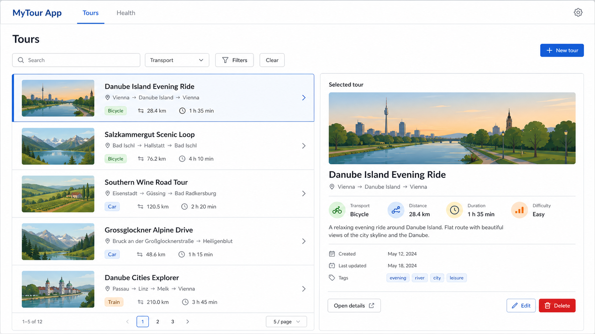
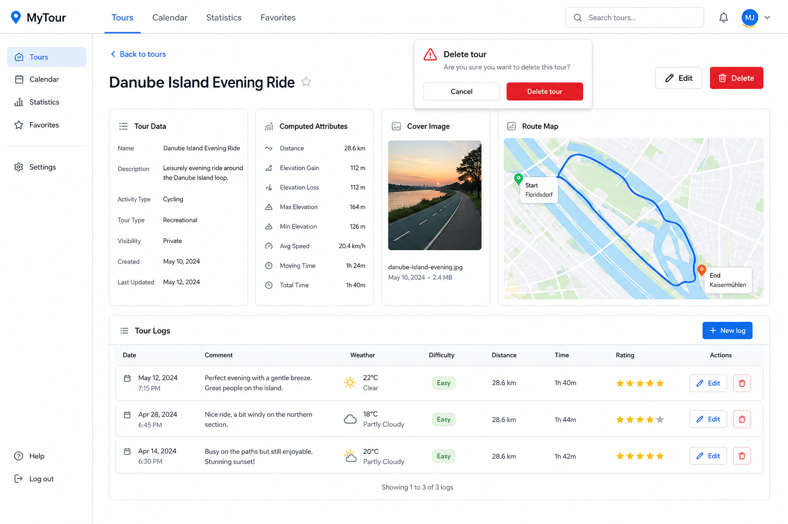
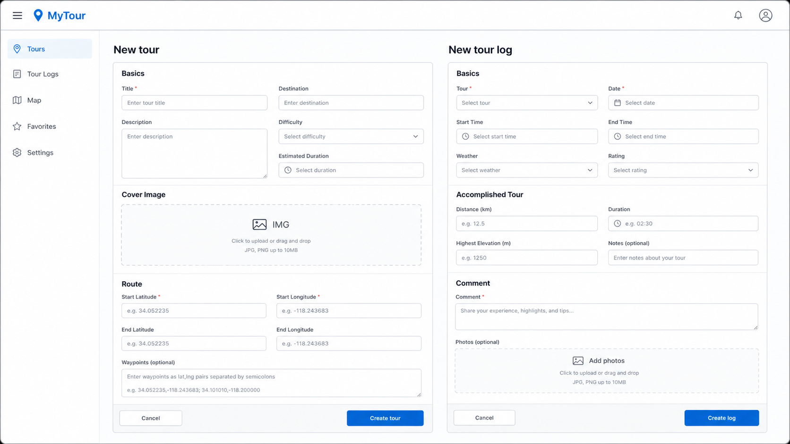
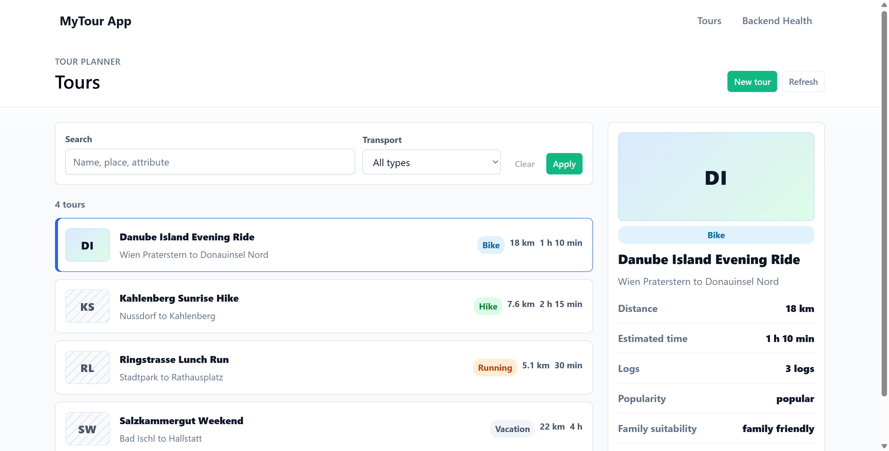
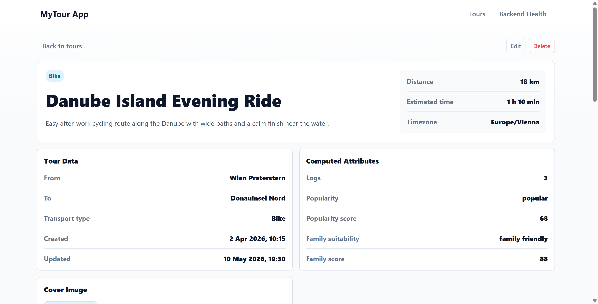
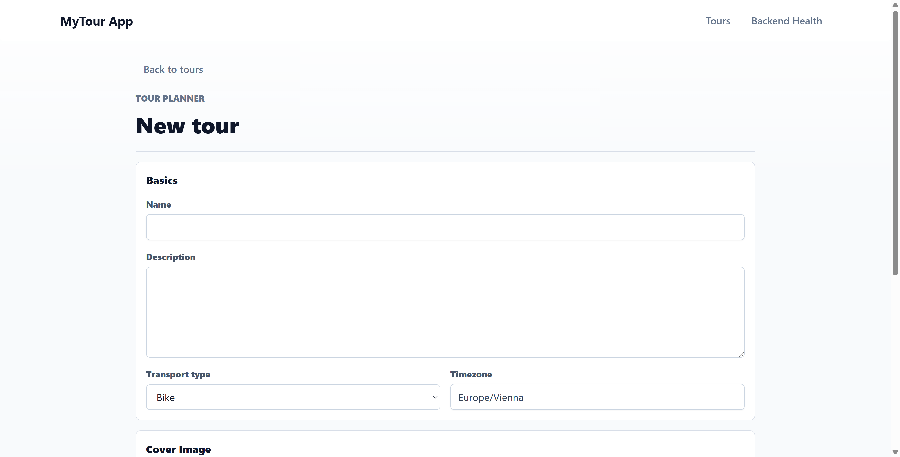
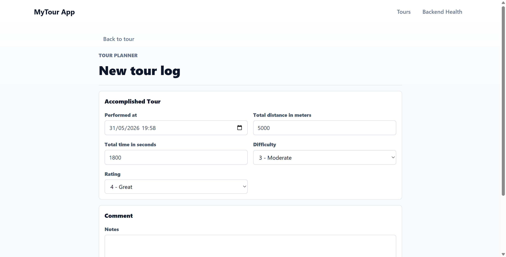
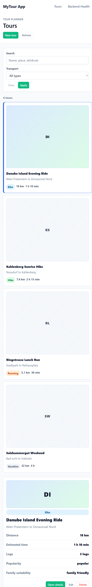

# MyTour Intermediate Protocol

## Project Information

**Project:** MyTour / Tour Planner  
**Hand-in:** Intermediate submission  
**Technology focus:** Angular frontend with backend integration  
**Date:** 2026-05-31  
**Team:** Tarik Yilmaz & Peyman Aparviz

## 1. Intermediate Scope

The intermediate submission focuses on the web frontend and its integration with the backend. The goal is to provide a usable Angular interface for managing tours and tour logs, while preparing the project structure for the final hand-in requirements.

The intermediate checklist requires:

- Angular as frontend framework.
- MVVM-style UI structure.
- Correct data binding between UI elements and view-model state.
- Responsive UI behavior.
- At least one reusable UI component.
- Tour create, modify, delete, list, and detail views.
- Tour attributes including image information and a map placeholder.
- Tour log create, modify, delete, and list views.
- Validation that prevents crashes on invalid input.
- UX description with wireframes.

Features such as real Leaflet map rendering, OpenRouteService integration, authentication, import/export, full-text search, final UML diagrams, and the full 20+ unit-test target are planned for the final hand-in.

## 2. UX Concept

The user interface follows a master-detail workflow. The user first lands on the tours overview, selects a tour from the list, and can immediately inspect important data in a side panel. More detailed information is available on a dedicated tour detail page. Creation and editing are handled through focused form pages.

The main UX decisions are:

- **Tours overview as main workspace:** The list and selected-tour panel make common management tasks visible without requiring navigation for every action.
- **Dedicated detail page:** The full tour page shows all tour attributes, computed values, route/map placeholder, cover image metadata, and tour logs.
- **Separate forms:** Tour and tour-log forms are separated to keep input tasks clear and avoid one large, overloaded page.
- **Primary actions on the right:** Save/create actions appear on the right, with cancel actions placed before them.
- **Delete confirmation:** Destructive actions require confirmation before the final delete call.
- **Intermediate placeholders:** Cover image and route map handling are visible as placeholders, because the real upload/map integration belongs to the final implementation phase.
- **Responsive layout:** Desktop views use multi-column layouts, while mobile screens collapse content into one column.

### Frontend Implementation Decisions

The frontend decisions from the implementation plan are reflected in the intermediate UI as follows:

- **Angular with MVVM-style separation:** Components bind to view-model services instead of containing backend or persistence logic directly.
- **Generated API client:** The Angular frontend uses generated API services and environment-based configuration to communicate with the Spring Boot backend.
- **Intermediate backend boundary:** The UI already calls backend endpoints for tour and tour-log CRUD. The same frontend service boundary can later be kept when persistence, authentication, and external APIs are expanded for the final hand-in.
- **Cover image handling:** The UI supports one cover image concept per tour through visible placeholders and metadata. Functional upload and filesystem storage are planned for the final implementation.
- **Route/map handling:** The intermediate UI shows a clear map placeholder. The final implementation will replace it with OpenRouteService route data and Leaflet rendering.
- **Time and timezone handling:** Tours include a timezone field so date/time values can later be displayed consistently for the tour location.
- **Transport types:** The UI uses the required transport categories: Bike, Hike, Running, and Vacation.
- **Tour-log values:** Difficulty and rating are handled as 1-to-5 values with user-friendly labels in the form.
- **Computed attributes:** Popularity and family suitability are visible in the detail UI as labels. The final implementation will complete the underlying score calculation and search integration.

## 3. Wireframes And Mockups

The following wireframes document the intended UI flow for the intermediate hand-in. The generated mockups below were created based on these wireframes and used as visual references while refining the implemented Angular UI. The generated mockups are not exact screenshots; they document the intended layout direction and interaction model.

### Text Wireframe: Tours Overview

Dropdown controls are written as labels such as `[Transport: All types]`.

```text
+----------------------------------------------------------------------------------+
|MyTour App                                                Tours | Backend Health  |
+----------------------------------------------------------------------------------+
|TOUR PLANNER                                                        [New tour]    |
|Tours                                                                             |
+----------------------------------------------------------------------------------+
|[Search: name, place, attribute]   [Transport: All types]   [Clear] [Apply]       |
+----------------------------------------------------------------------------------+
|Tour list                                             | Selected tour             |
|------------------------------------------------------+---------------------------|
|IMG  Danube Island Evening Ride      Bike  18 km     | cover image placeholder    |
|     Wien Praterstern -> Donauinsel                   | Danube Island Ride        |
|------------------------------------------------------+ Distance: 18 km           |
|IMG  Kahlenberg Sunrise Hike         Hike  7.6 km    | Time: 1 h 10 min           |
|     Nussdorf -> Kahlenberg                           | Logs: 3                   |
|------------------------------------------------------+                           |
|                                                      | [Open details] [Edit]     |
|                                                      | [Delete]                  |
+----------------------------------------------------------------------------------+
```

### Text Wireframe: Tour Detail

```text
+----------------------------------------------------------------------------------+
|[Back to tours]                                             [Edit] [Delete]       |
+----------------------------------------------------------------------------------+
|Danube Island Evening Ride                                                        |
|Easy after-work cycling route along the Danube.                                   |
|                                                                                  |
|Summary                                  | Tour Data                              |
|-----------------------------------------+----------------------------------------|
|Distance: 18 km                          | From: Wien Praterstern                 |
|Estimated time: 1 h 10 min               | To: Donauinsel Nord                    |
|Timezone: Europe/Vienna                  | Transport: Bike                        |
|                                                                                  |
|Cover Image                              | Computed Attributes                    |
|-----------------------------------------+----------------------------------------|
|File/path metadata or placeholder        | Logs, popularity, family score         |
|                                                                                  |
|Route Map Placeholder                                                             |
|[start pin] -------- route line over map-like background -------- [end pin]       |
|                                                                                  |
|Tour Logs                                                                         |
|Date, comment, weather, difficulty, distance, time, rating, edit/delete actions   |
+----------------------------------------------------------------------------------+
```

### Text Wireframe: Forms

```text
+----------------------------------------------------------------------------------+
|[Back to tours]                                                                   |
+----------------------------------------------------------------------------------+
|New tour / Edit tour                                                              |
|                                                                                  |
|Basics                                                                            |
|[Name] [Description] [Transport type] [Timezone]                                  |
|                                                                                  |
|Cover Image                                                                       |
|[Image placeholder and explanatory text]                                          |
|                                                                                  |
|Route                                                                             |
|[Start location] [End location] [Start/end coordinates]                           |
|                                                                 [Cancel] [Save]  |
+----------------------------------------------------------------------------------+

+----------------------------------------------------------------------------------+
|[Back to tour]                                                                    |
+----------------------------------------------------------------------------------+
|New tour log / Edit tour log                                                      |
|                                                                                  |
|Accomplished Tour                                                                 |
|[Performed at] [Total distance] [Total time] [Difficulty] [Rating]                |
|                                                                                  |
|Comment                                                                           |
|[Notes]                                                                           |
|                                                           [Cancel] [Create log]  |
+----------------------------------------------------------------------------------+
```

### Tours Overview Mockup



### Tour Detail Mockup



### Forms Mockup



## 4. Implemented UI Screens

The following screenshots were captured from the Docker-served Angular application at `http://localhost:4200`.

### Tours Overview

This view demonstrates the main tour list, search/filter controls, selected-tour preview panel, cover image placeholder, and common actions.



### Tour Detail

The detail page shows all selected tour attributes, cover image metadata, computed attributes, the map placeholder, and the tour-log list.



### Tour Form

The tour form groups input fields into consistent sections and includes validation-ready fields for basic data, image placeholder, and route coordinates.



### Tour Log Form

The log form captures the required accomplished-tour attributes: performed date/time, distance, time, difficulty, rating, and comment.



### Mobile Layout

The mobile screenshot demonstrates that the layout collapses into a single-column workflow and remains usable on narrow screens.



## 5. MVVM And Frontend Structure

The Angular frontend uses an MVVM-style structure. Components are responsible for templates and user interaction, while view-model services hold state, expose derived values, and coordinate backend calls.

Examples:

- `ToursListViewModelService` manages the tour list, selected tour, filters, loading state, notices, errors, and delete confirmation state.
- `TourDetailViewModelService` manages detail-page state, selected tour loading, logs, and delete confirmation behavior.
- Form view-model services manage create/edit form state, validation, submission, and navigation after successful save.

This keeps persistence and state-management logic out of the templates and makes the UI easier to test.

## 6. Reusable UI Component

The project defines a reusable status-message component used for notice, loading, and error messages. This avoids duplicating message markup and styling across pages.

The component supports variants such as:

- notice
- error
- loading

## 7. Backend Integration

The Angular UI communicates with the backend through generated API client services and environment-based API configuration. The Docker setup runs:

- Angular frontend on `http://localhost:4200`
- Spring Boot backend on `http://localhost:8282`
- PostgreSQL database in Docker

The intermediate UI was verified against the backend through Docker Compose. The verified flows include:

- Load tours from backend.
- Select a tour and show its detail data.
- Create a tour.
- Edit a tour.
- Delete a tour with confirmation.
- Show logs for a selected tour.
- Create a tour log.
- Edit a tour log.
- Delete a tour log.

## 8. Checklist Mapping

| Checklist item | Intermediate status | Evidence |
| --- | --- | --- |
| Uses Angular as frontend framework | Done | Angular app in `mytour-ui` |
| Uses MVVM for UI | Done | Component templates bind to view-model services |
| Correct data binding | Done | List, detail, filters, and forms update from view-model state |
| Responsive UI | Done | Desktop and mobile screenshots |
| Reusable UI component | Done | Shared status-message component |
| Create/modify/delete tour | Done | Tour list, detail actions, and tour form |
| Tour list with required attributes including image | Done | List rows and selected panel show required attributes and image placeholder |
| Tour detail with all attributes and map placeholder | Done | Detail screenshot shows attributes and route-map placeholder |
| Tour validation | Done | Angular form validation prevents invalid/empty required input from crashing the UI |
| Create/modify/delete tour log | Done | Detail page log actions and log form |
| Tour log required attributes | Done | Log list and form include date/time, comment, difficulty, distance, time, and rating |
| Tour logs list for selected tour | Done | Detail page shows logs for selected tour |
| Tour log validation | Done | Angular log form validation prevents invalid input from crashing the UI |
| Protocol describes UX and includes wireframes | Done | This protocol |

## 9. Validation And Error Handling

The forms use Angular validation and typed inputs for required numeric/date values. Invalid input is handled through form state and validation messages instead of causing crashes.

The UI also contains user-facing message areas for loading, notices, and errors. These states are important for backend integration because failed HTTP calls should be visible to the user.

## 10. Verification

The following checks were performed for the intermediate state:

- `npm run build` passes.
- `npm test` passes with 14 frontend tests.
- Docker frontend was rebuilt and checked at `http://localhost:4200`.

## 11. Known Limitations For Intermediate Hand-In

The following items are intentionally left for the final submission:

- Real Leaflet map rendering.
- OpenRouteService route retrieval for distance, duration, and route geometry.
- Functional cover image upload and filesystem storage.
- Authentication, registration, login, and per-user ownership.
- Full PostgreSQL-backed final persistence for every feature where still pending.
- Full-text search across tours, logs, and computed attributes.
- Import/export.
- Unique feature implementation: automatic weather snapshot for tour logs.
- Final protocol UML diagrams: use-case diagram, class diagram, and full-text-search sequence diagram.
- Final unit-test target of at least 20 tests.

## 12. Time Tracking

| Date | Person | Area | Time | Work performed |
| --- | --- | --- | ---: | --- |
| 2026-04-29 | Tarik Yilmaz | Setup | 0.5 h | Initial repository setup for frontend and backend. |
| 2026-05-01 | Peyman Aparviz | Backend setup | 3.5 h | Initialized Spring Boot backend, dependencies, Dockerfile, database setup, Docker Compose, CORS, datasource configuration, frontend service in Compose, README update. |
| 2026-05-01 | Peyman Aparviz | Frontend setup | 4.0 h | Initialized Angular project, added HTTP client, environment setup, Tailwind, PrimeNG, health page, Dockerfile, README update. |
| 2026-05-05 | Tarik Yilmaz | Documentation | 1.0 h | Added initial class diagram and use-case diagram drafts. |
| 2026-05-06 | Peyman Aparviz | Project docs | 0.5 h | Added repository guidance / AGENTS documentation. |
| 2026-05-07 | Peyman Aparviz | Planning | 1.0 h | Added implementation TODO list for intermediate and final milestones. |
| 2026-05-13 | Peyman Aparviz | Backend | 2.0 h | Added database design draft, DB initialization/class diagram, controllers, DTOs, domain models, repositories, Flyway migration setup and initial schema. |
| 2026-05-13 | Peyman Aparviz | API client | 1.5 h | Added OpenAPI download/generation scripts, generated API models/services, updated TypeScript config, TODOs, and project decisions. |
| 2026-05-16 | Tarik Yilmaz | Backend API | 2.0 h | Added intermediate tour and tour-log services, controller methods, CRUD operations, and test configuration changes. |
| 2026-05-16 | Tarik Yilmaz | Tour UI | 2.0 h | Added routing, tours list, selected-tour panel, tour detail page, filtering, loading/error states, and responsive styling. |
| 2026-05-16 | Tarik Yilmaz | Forms | 2.0 h | Added tour create/edit form and tour-log create/edit form with validation, routing, view models, and responsive styles. |
| 2026-05-16 | Tarik Yilmaz | Component | 1.0 h | Added reusable status-message component and replaced duplicated notice/error banners across UI pages. |
| 2026-05-31 | Peyman Aparviz | Refactor/tests | 2.0 h | Refactored view-model display logic, route lifecycle handling, health state handling, and added frontend unit test coverage. |
| 2026-05-31 | Peyman Aparviz | Checklist fixes | 1.5 h | Reviewed checklist, fixed form field attributes, fixed delete confirmation behavior, updated implementation TODO evidence. |
| 2026-05-31 | Peyman Aparviz | UX | 2.0 h | Improved map placeholder, cover image placeholders, form section consistency, action placement, and light theme styling. |
| 2026-05-31 | Peyman Aparviz | Mockups | 1.5 h | Created intermediate wireframes, generated mockups, compared mockups with implemented UI, and adjusted design direction. |
| 2026-05-31 | Peyman Aparviz | Screenshots | 1.0 h | Captured protocol screenshots for desktop and mobile views. |
| 2026-05-31 | Peyman Aparviz | Protocol | 1.0 h | Drafted intermediate protocol Markdown and prepared checklist mapping, UX explanation, screenshots, mockups, and known limitations. |
| **Total** |  |  | **28.5 h** |  |

## 13. Git Repository

Git history is part of the documentation, as stated in the project description.

Repository links:
- Frontend: https://github.com/tarik-yilmaz/mytour-ui
- Backend: https://github.com/tarik-yilmaz/mytour-api
